# hw3_software_architecture

## Розгортання системи

Для запуску всього кластера мікросервісів використовується Docker Compose
Система піднімається з нуля з білдом актуальних образів командою `docker compose up -d --build`
Після завершення білду можна переконатися, що всі контейнери працюють коректно за допомогою команди `docker ps`

## Балансування навантаження

Для перевірки роботи балансувальника було використано файл manual_test.http, з якого відправлено 10 послідовних POST-запитів.

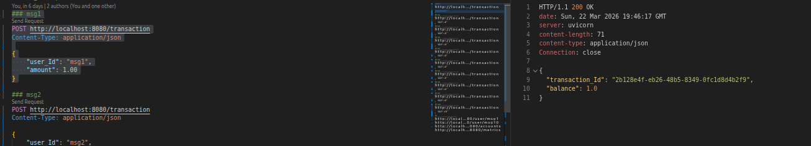

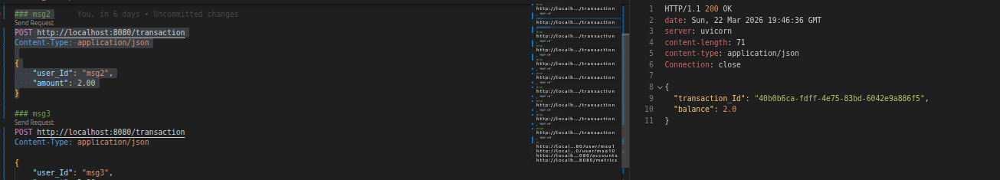

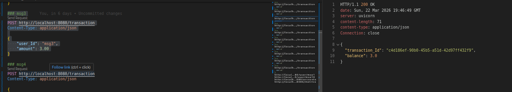

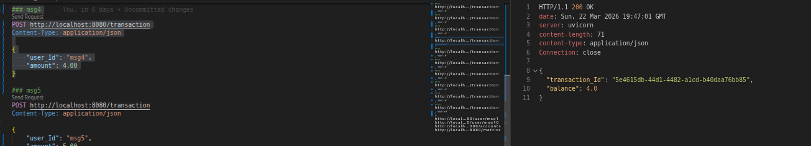

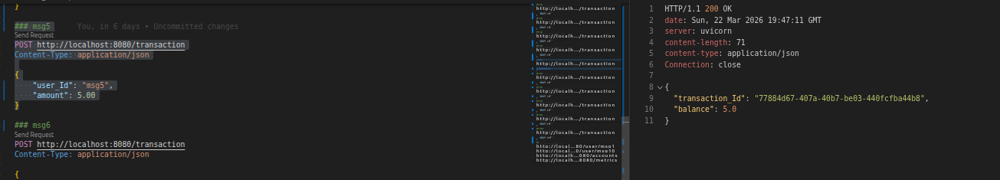

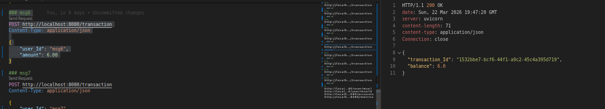

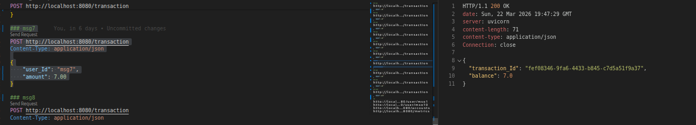

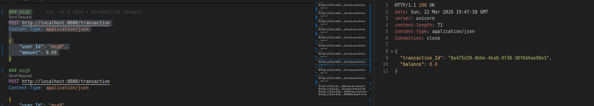

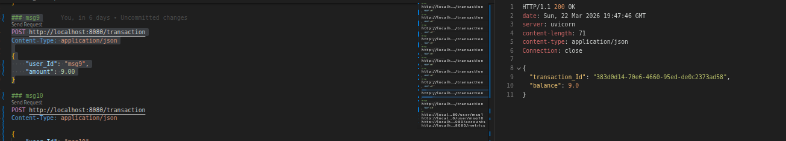

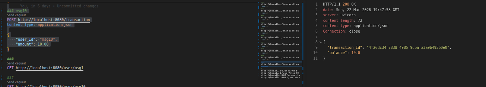

Після виконання POST-запитів були перевірені логи кожного екземпляра сервісу логування. Розподіл трафіку доводить коректну роботу балансувальника. Запити успішно розподілилися між трьома піднятими інстансами логера.

Логи з logging1 (обробив запити msg5, msg9, msg10):

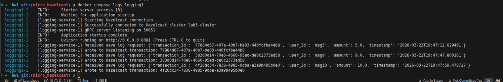

Логи з logging2 (обробив запити msg2, msg8):

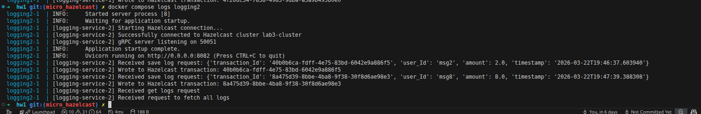

Логи з logging3 (обробив запити msg1, msg3, msg4, msg6, msg7):

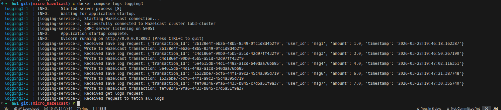

Логи facade-service:

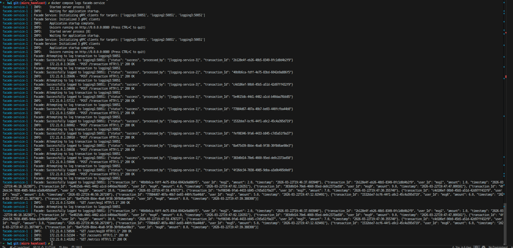

У логах фасаду видно процес балансування. Фасад динамічно перемикається між доступними gRPC клієнтами і виводить повідомлення Successfully logged to... для різних інстансів логера.

### Перевірка збереження даних та роботи Counter Service

Також коректність збереження даних перевірена через GET-запити з manual_test.http.

Результати GET-запитів:

GET /user/msg1 та /user/msg10: 

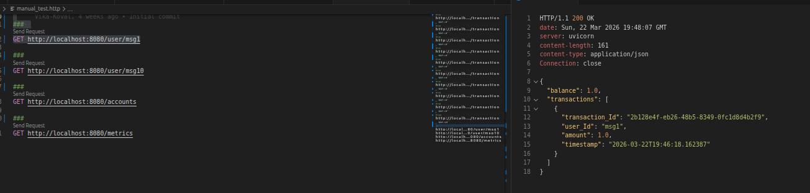

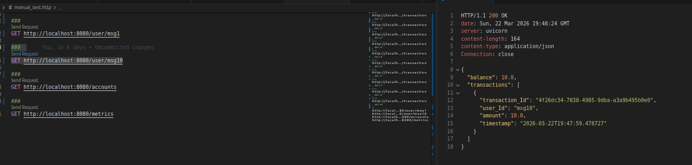

Система успішно агрегує дані з двох різних мікросервісів. Підтягує поточний баланс з PostgreSQL та історію транзакцій з пам'яті Hazelcast.

GET /accounts: 

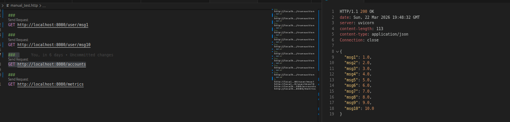

Успішно повертає словник з усіма створеними користувачами та їхніми балансами.

GET /metrics: 

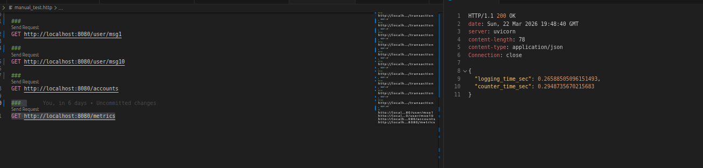

Демонструє, що фасад успішно заміряє та накопичує час виконання запитів до логера та лічильника.

Логи counter-service:

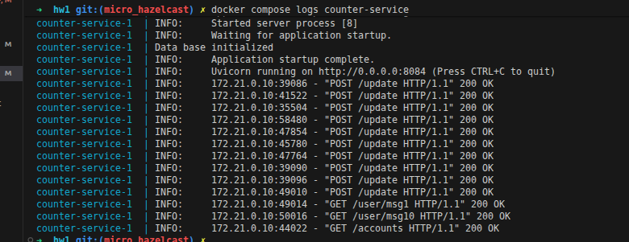

Сервіс лічильника також успішно ініціалізувався та обробив усі POST та GET запити від фасаду, про що свідчать статуси 200 OK в терміналі.

## Перевірка відмовостійкості

### Відмовостійкість gRPC сервісів (Логери)

Щоб перевірити, як фасад реагує на падіння одного з вузлів, було зупинено перший логер `docker compose stop logging1`.

Відправляємо ті самі запити, що й в попередній частині.

Перевіримо загальний баланс.

Бачимо, що все добре.

Тепер, зупинено наступну ноду `docker compose stop logging2`.

Відправляємо ті самі запити, що й в попередній частині.

Перевіримо загальний баланс.

### Відмовостійкість кластера Hazelcast

Наступним кроком було перевірено стійкість in-memory бази даних. Було примусово зупинено першу ноду кластера `docker compose stop hazelcast1`.

Відправляємо ті самі запити, що й в попередній частині.

Перевіримо загальний баланс.

Аналогічно зупинемо наступну ноду `docker compose stop hazelcast2`.

Відправляємо ті самі запити, що й в попередній частині.

Перевіримо загальний баланс.

## Навантажувальне тестування 

Для аналізу продуктивності використовувався скрипт load_test.py, щоб порівняти послідовний підхід обробки запитів та паралельний.

Було розглянуто 2 основні сценарії.

Сценарій 1 

10 клієнтів одночасно роблять по 10 000 транзакцій поповнення на свої унікальні рахунки.

Сценарій 2

10 клієнтів одночасно намагаються поповнити один і той самий рахунок, що створює блокування бази даних.

Для паралельної імлпементації:

Для послідовної імлпементації:

Результати демонструють перевагу асинхронного підходу. У сценарії з незалежними рахунками паралельне виконання покращило пропускну здатність на 9%. У більш екстремальному сценарії з конкурентним доступом до спільного рахунку приріст продуктивності склав майже 47%. asyncio.gather ефективно нівелює час очікування I/O операцій між gRPC та HTTP.

