## hw4_software_architecture

Я обрала Kafka як message queue.

## Інсталяція

Щоб підняти всі сервіси, використовується docker compose `docker compose up -d --build`

## Демонстрація

Завдання:
- Запускається config-server,
- Запустити facade-service, counter-service та три екземпляра
logging-service (кожен з екземплярів запускається у власному
Docker-контейнері), і далі реєструється в config-server,
- Відповідно має запуститись також кластер Hazelcast з трьох
серверів

Після білду перевіряємо, що всі контейнери запущені через `docker ps`

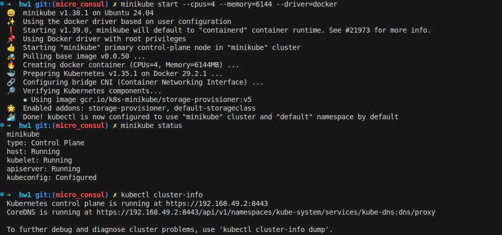

Базові ендпоінти:

Перевіряємо список зареєстрованих сервісів

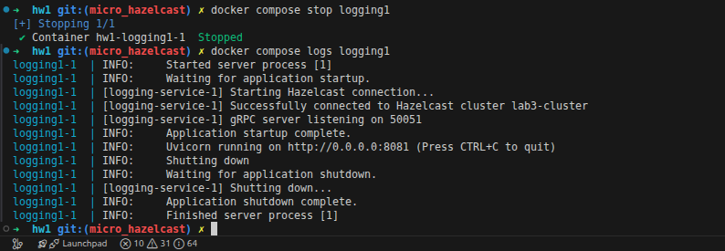

Видно, що facade-service, counter-service та всі три екземпляри logging-service успішно зареєструвалися.

Перевіряємо конфігурацію Kafka та Hazelcast

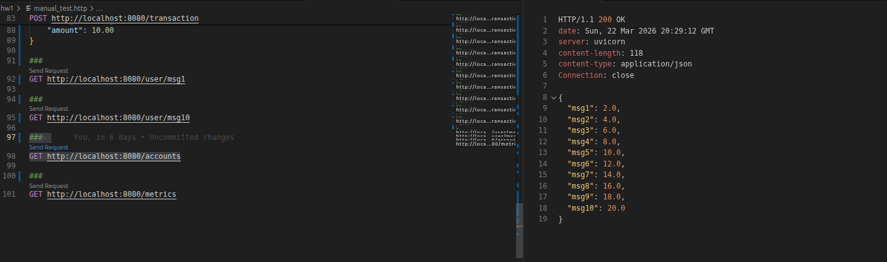

- Через HTTP POST записати 10 транзакцій msg1-msg10 через facade-service

Далі, я надсилаю POST запити з manual_test.http:

Приклад відповіді для msg2 

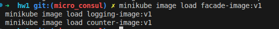

Приклад для msg4 

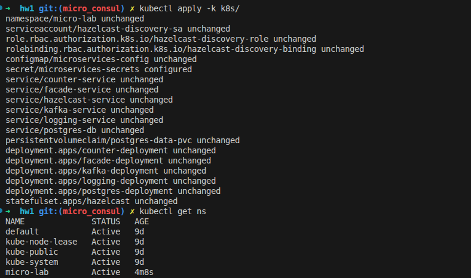

Приклад для msg7

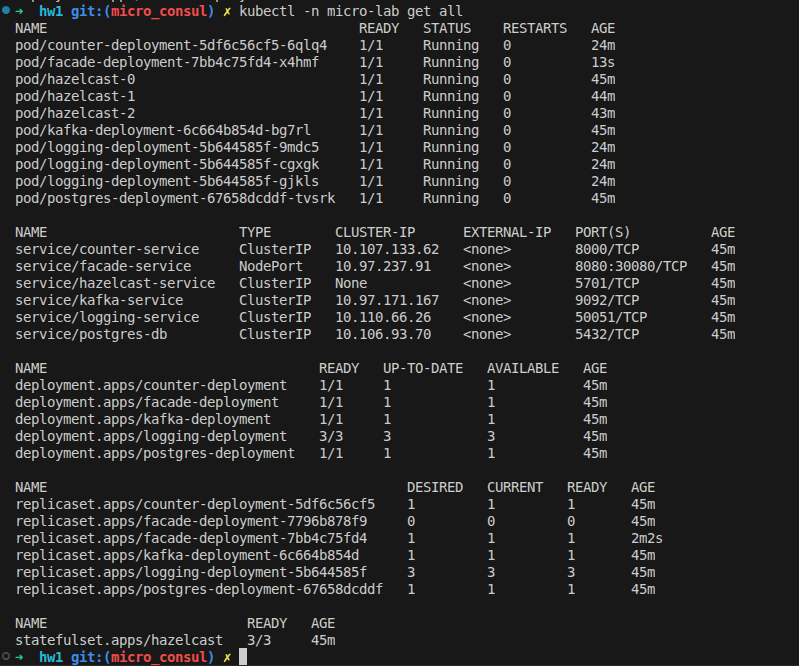

Кожен запит потрапляє на різні partition/offset пари, що підтверджує коректну роботу черги.

Загальна ситуація по акаунтах

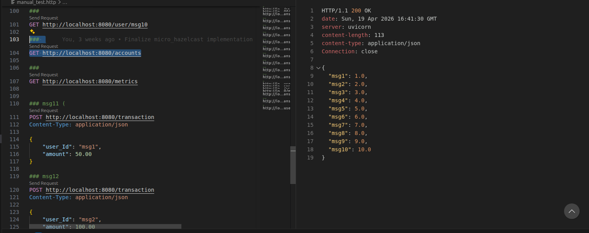

- Показати що повідомлення отримують різні екземпляри logging-service (це має бути видно у логах сервісу)

Перевіряємо логи кожного з трьох екземплярів logging-service. Повідомлення розподіляються між інстансами, що підтверджує балансування навантаження.

**logging1** отримував транзакції msg1, msg6, msg8:

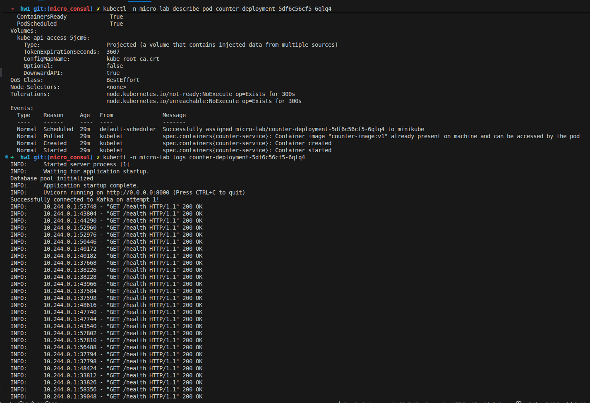

**logging2** отримував транзакції msg9, msg10:

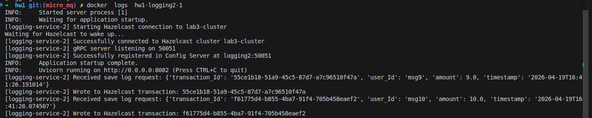

**logging3** отримував транзакції msg2, msg3, msg4, msg5, msg7:

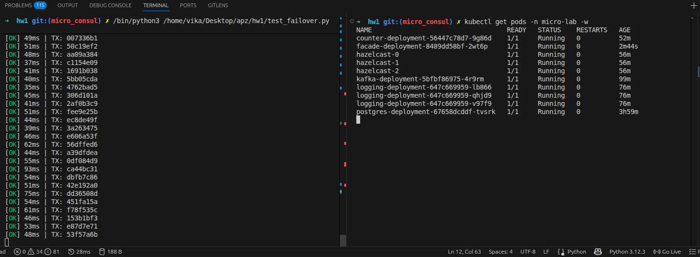

Кожен екземпляр успішно підключився до Hazelcast кластера `lab3-cluster`, запустив gRPC-сервер на порту 50051 та зареєструвався в config-server.

Логи counter-servise

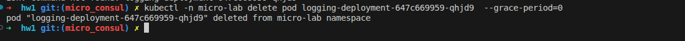

- Через HTTP GET з facade-service прочитати транзакції, перевірити що значення на рахунках є коректним

Запит `GET /accounts` повертає всі поточні баланси, всі 10 користувачів мають коректні значення від 1.0 до 10.0

В логах counter-service видно, що він успішно зконсюмив усі повідомлення з Kafka:

Надсилаємо ще транзакцію msg1 на 50.00 

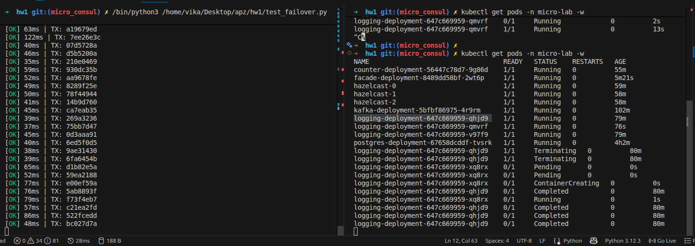

Перевіряємо рахунок msg1 через `GET /user/msg1`. Баланс 51, в транзакціях відображаються обидва записи 1 та 50

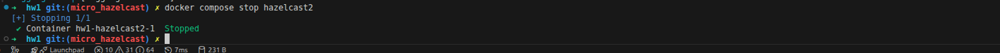

## Відмовостійкість

- Вимкнути чи зробити недоступним (docker pause) counter-service
та перевірити, що запис транзакцій йде без помилок (бо транзакції
до counter-service накопичуються у message queue)

Перевіряєм відмовостійкість, коли падає counter.Зупиняємо counter-service через `docker pause`

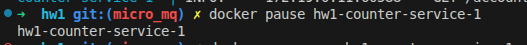

Перевіряємо статус, контейнер у стані Paused:

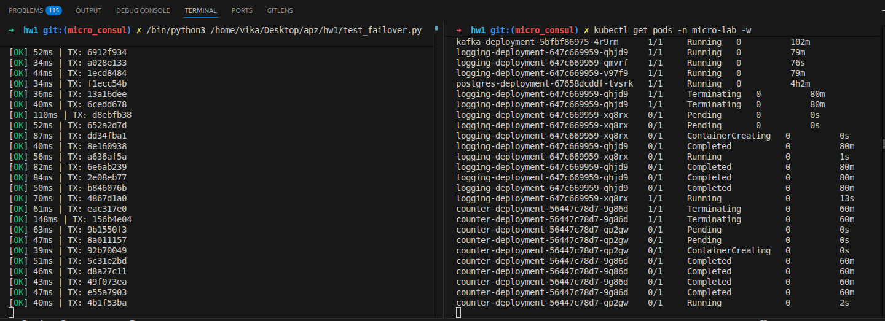

Надсилаємо нові транзакції (msg1 на 50.00, msg2 на 100.00) поки counter-service недоступний. Facade-service успішно приймає запити і повертає статус 200, транзакції ставляться у чергу Kafka без помилок:

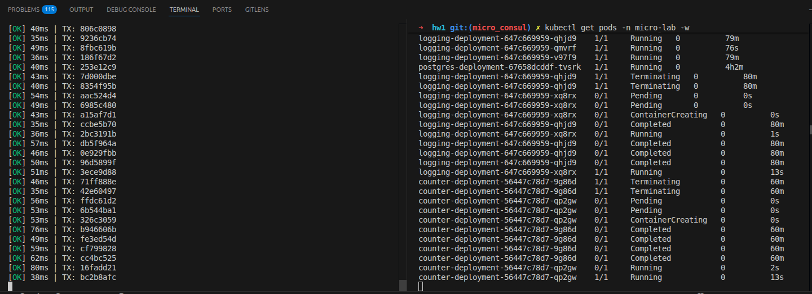

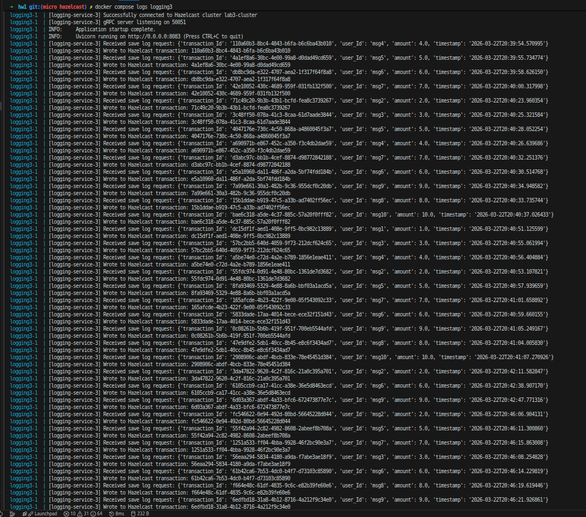

- При цьому, відповідно GET-запити не мають спрацьовувати, мають або повертати null у якості значень на рахунку

Поки counter-service зупинений, GET-запити повертають `null`, оскільки сервіс не може отримати актуальний баланс

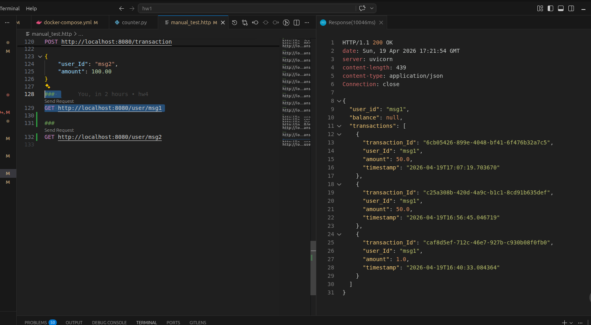

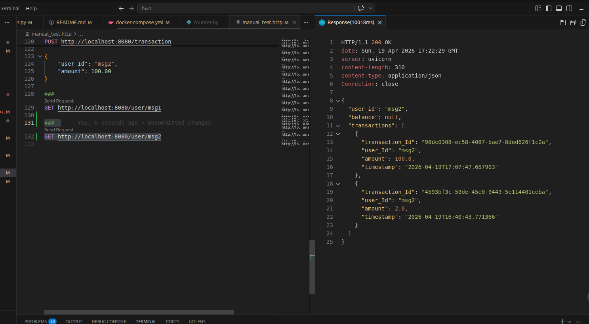

`GET /accounts` також повертає `null`, оскільки counter впав

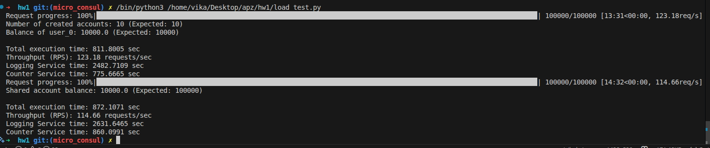

Перевіряєм стан Kafka.
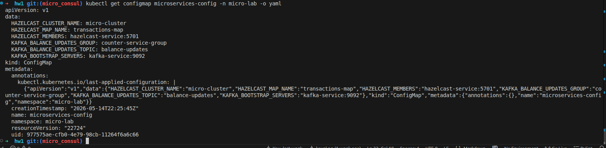

Видно lag на partition 2, що свідчить про накопичення непрочитаних повідомлень

- Знову запустити counter-service та переконатись, що за деякий час він зчитує з черги накопичені до нього транзакції, застосує їх та почне повертати коректні значення рахунків

Розморожуємо counter-service через `docker unpause` та переглядаємо логи

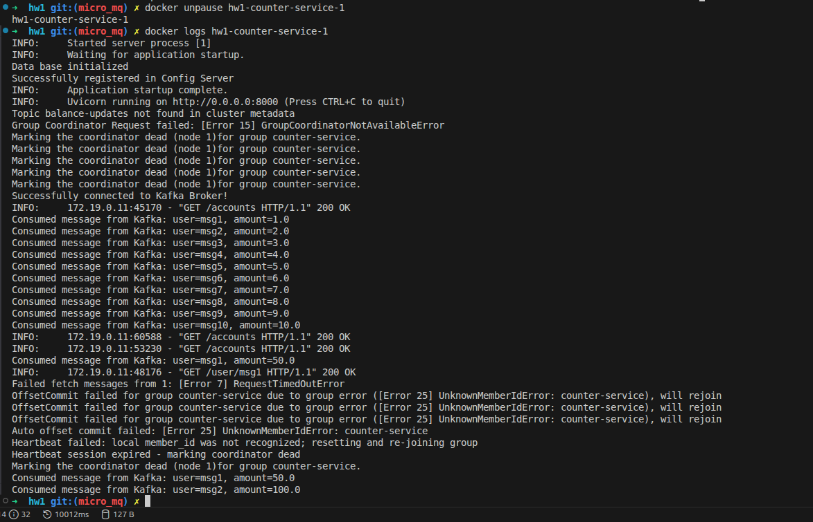

Сервіс успішно перепідключився до Kafka Broker та вичитав усі накопичені повідомлення з черги

Повторна перевірка consumer group показує lag = 0 по всіх партиціях, отже усі повідомлення оброблені

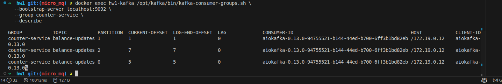

Перевіряємо `GET /user/msg1`. Баланс 101, всі транзакції враховані

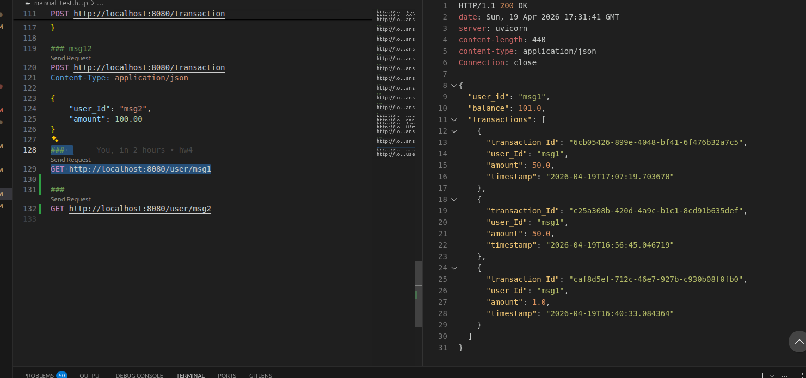

Перевіряємо `GET /user/msg2`, баланс 102

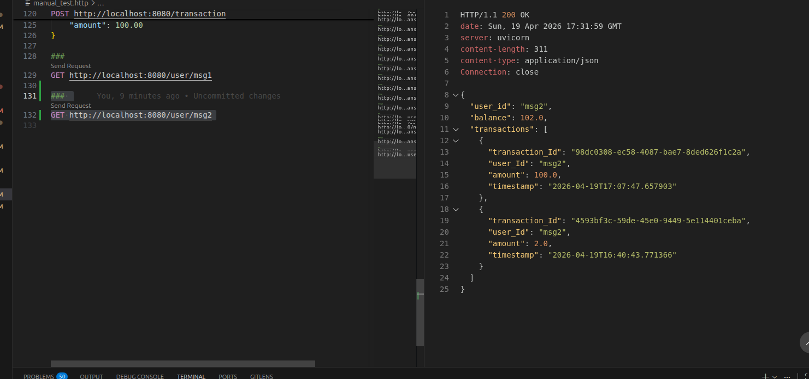

`GET /accounts` тепер повертає коректні баланси для всіх користувачів

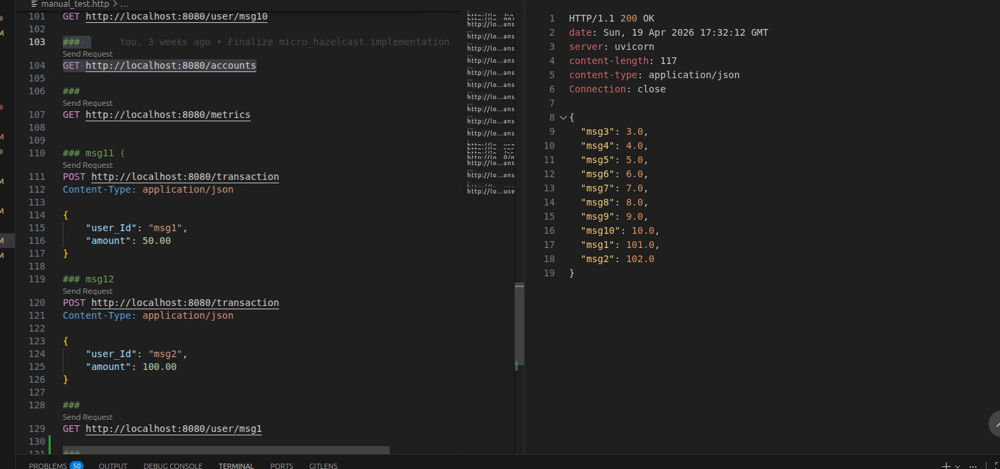

Всі транзакції дійшли успішно