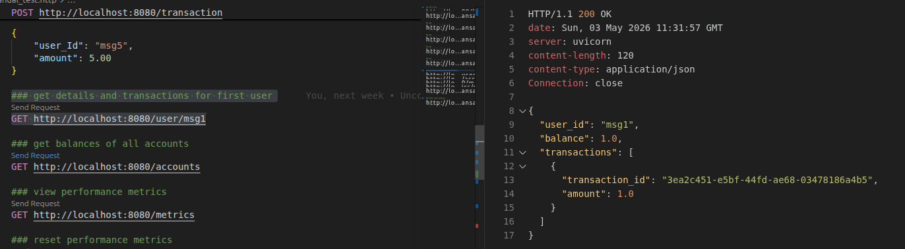
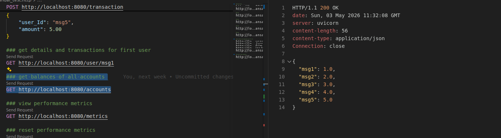
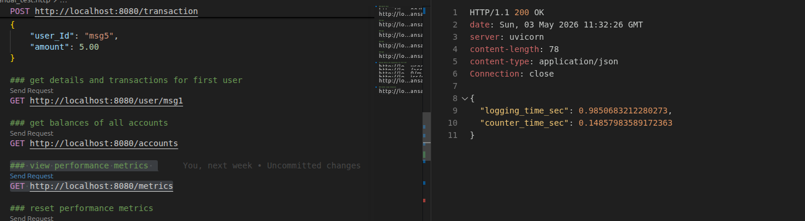

# hw5_software_architecture

## АРХІТЕКТУРА ПРОЄКТУ ТА ПОТІК ЗАПИТІВ

Система складається з трьох мікросервісів, які розгорнуті у **Kubernetes (Minikube)**.
Kubernetes виконує роль **Service Register**, **Service Discovery** та **Config Server**.

Потік взаємодії виглядає наступним чином:

1. Клієнт відправляє POST-запит до **Facade Service**.
2. Facade Service отримує адреси **Logging Service** та **Counter Service** через Kubernetes DNS (Service Discovery) — жодних захардкоджених IP у коді чи конфігах.
3. Facade Service звертається до **Logging Service** — повідомлення ставиться у чергу Kafka та повертається `transaction_id` і `offset`.
4. **Counter Service** споживає повідомлення з Kafka, зберігає транзакцію у **PostgreSQL** та оновлює баланс.
5. Facade Service повертає клієнту `transaction_id`, `queued: true` та `offset`.

Конфігурації для Hazelcast та Message Queue (Kafka) зберігаються у **Kubernetes ConfigMap** та **Secrets** і зчитуються сервісами при старті через змінні середовища.

---

## KUBERNETES OBJECTS

| Файл | Обʼєкти |
|---|---|
| `namespace.yml` | Namespace `micro-lab` |
| `configmap.yml` | ConfigMap `microservices-config` (всі runtime-конфіги) |
| `secrets.yml` | Secret `microservices-secrets` (DATABASE_URL) |
| `postgres.yml` | PVC + Deployment + ClusterIP Service |
| `hazelcast.yml` | StatefulSet (3 поди) + headless Service |
| `kafka.yml` | Deployment + ClusterIP Service |
| `logging.yml` | Deployment (3 репліки) + ClusterIP Service |
| `counter.yml` | Deployment + ClusterIP Service |
| `facade.yml` | Deployment + NodePort Service (:30080) |

---

## CONFIGMAP — CONFIG SERVER (Вимоги 3 і 4)

Налаштування для Hazelcast та Kafka зберігаються як key/value у Kubernetes ConfigMap і зчитуються сервісами через змінні середовища — жодних статичних значень у коді.

```bash
kubectl get configmap microservices-config -n micro-lab -o yaml
```


### ConfigMap key/value pairs

| Key | Значення | Зчитується |
|---|---|---|
| `HAZELCAST_CLUSTER_MEMBERS` | `hazelcast-0.hazelcast-service…:5701,…` | logging-service |
| `HAZELCAST_CLUSTER_NAME` | `dev` | logging-service |
| `KAFKA_BOOTSTRAP_SERVERS` | `kafka-service:9092` | facade-service, counter-service |
| `KAFKA_TOPIC` | `transactions` | facade-service, counter-service |
| `LOGGING_SERVICE_URL` | `http://logging-service.micro-lab.svc.cluster.local:50051` | facade-service |
| `COUNTER_SERVICE_URL` | `http://counter-service.micro-lab.svc.cluster.local:8000` | facade-service |

---

## SERVICE REGISTRY & DISCOVERY (Вимоги 1 і 2)

У Kubernetes кожен обʼєкт `Service` автоматично реєструє свої поди у kube-dns. Facade Service знаходить `logging-service` та `counter-service` виключно за DNS-іменем — без статичних адрес у коді.

```bash
kubectl get services -n micro-lab
kubectl get endpoints -n micro-lab
```


Вивід `endpoints` показує IP окремих подів за ClusterIP `logging-service` — саме їх резолвить facade при виклику `http://logging-service.micro-lab.svc.cluster.local`.

---

## РОЗГОРТАННЯ У KUBERNETES

### Підняти minicube


### Білд докер імеджів


### Завантаження образів у Minikube


### Застосування Kubernetes-маніфестів 


### Стан усіх ресурсів у namespace `micro-lab`


### Перевірка подів 


### Рod describe для counter-service та логи — успішний старт та health checks 


### Port-forward facade-service 


### Запуск Minikube та перевірка кластера


---

## РЕЗУЛЬТАТИ РУЧНОГО ТЕСТУВАННЯ

Мікросервіси були протестовані за допомогою запитів з файлу `manual_test.http`.
Нижче наведено результати ручного тестування:

### health check
GET http://localhost:8080/health


## msg1

### msg1 +1.00
POST http://localhost:8080/transaction
Content-Type: application/json

```json
{
    "user_Id": "msg1",
    "amount": 1.00
}
```


## msg2

### msg2 +2.00
POST http://localhost:8080/transaction
Content-Type: application/json

```json
{
    "user_Id": "msg2",
    "amount": 2.00
}
```


## msg3

### msg3 +3.00
POST http://localhost:8080/transaction
Content-Type: application/json

```json
{
    "user_Id": "msg3",
    "amount": 3.00
}
```


## msg4

### msg4 +4.00
POST http://localhost:8080/transaction
Content-Type: application/json

```json
{
    "user_Id": "msg4",
    "amount": 4.00
}
```


## msg5

### msg5 +5.00
POST http://localhost:8080/transaction
Content-Type: application/json

```json
{
    "user_Id": "msg5",
    "amount": 5.00
}
```


## All

### Get details and transactions for first user
GET http://localhost:8080/user/msg1



### Get balances of all accounts
GET http://localhost:8080/accounts



### View performance metrics
GET http://localhost:8080/metrics



Як видно зі скріншотів, транзакції успішно ставляться у чергу, баланси оновлюються коректно,
а сервіси взаємодіють через Kubernetes Service Discovery належним чином. Також завдяки скрипту `save_logs.py` було записано логи сервісів і збережено в папку `service_logs`.

---

## МАСШТАБУВАННЯ

Kubernetes дозволяє масштабувати репліки однією командою — на відміну від попередніх лаб, де кожен екземпляр був окремим контейнером з власним іменем.

```bash
# Зменшити до 1 репліки
kubectl scale deployment logging-service -n micro-lab --replicas=1
kubectl get pods -n micro-lab -l app=logging-service

# Повернути до 3 реплік
kubectl scale deployment logging-service -n micro-lab --replicas=3
kubectl get pods -n micro-lab -l app=logging-service
```

---

## ТЕСТУВАННЯ ВІДМОВОСТІЙКОСТІ (FAILOVER) (Вимога 5)

Для перевірки відмовостійкості було примусово видалено поди сервісів під час активного навантаження скриптом `test_failover.py`.
Kubernetes автоматично перезапускав поди та перенаправляв трафік до працюючих екземплярів.

### Видалення пода logging-service


### Перезапуск logging-service — трафік продовжує йти без втрат, новий под піднімається


### Видалення пода counter-service


### Перезапуск counter-service — запити продовжують оброблятися, Kubernetes створює новий под


### Видалення пода facade-service


### Все падає у тому числі port-forward втрачає з'єднання на час перезапуску facade-service


Усі запити під час відмов logging-service та counter-service завершилися зі статусом `[OK]`.
При видаленні пода facade-service — port-forward короткочасно втратив з'єднання,
що є очікуваною поведінкою, оскільки port-forward прив'язаний до конкретного пода.

---

## ОЦІНКА ПРОДУКТИВНОСТІ

Навантажувальне тестування проводилося за допомогою скрипта `load_test.py`.

Було розглянуто два сценарії:

**Сценарій 1:** 10 акаунтів одночасно роблять транзакції на власні окремі рахунки (разом 100 000 запитів).  
**Сценарій 2:** 10 акаунтів одночасно роблять транзакції на один і той самий спільний рахунок (разом 100 000 запитів).


### Порівняльна таблиця

| Test scenarios | Task 1 (in-mem) | Task 3 (DB) | Task 5 (final) |
|---|---|---|---|
| **10 accounts** | | | |
| Total time | 811.94 sec | 605.27 sec | 811.80 sec |
| logging-service contribution | 4719.22 sec | 1214.05 sec | 2482.71 sec |
| counter-service contribution | 4892.35 sec | 3711.98 sec | 775.67 sec |
| **1 account** | | | |
| Total time | 850.99 sec | 661.87 sec | 872.11 sec |
| logging-service contribution | 4921.21 sec | 1619.18 sec | 2631.65 sec |
| counter-service contribution | 4893.40 sec | 5380.60 sec | 860.10 sec |

---

## АНАЛІЗ ПРОДУКТИВНОСТІ

- **Сценарій 1 (10 акаунтів):** загальний час — 811.80 с, пропускна здатність — 123.18 req/s, баланс кожного з 10 акаунтів підтверджено як 10 000.
- **Сценарій 2 (1 спільний акаунт):** загальний час — 872.11 с, пропускна здатність — 114.66 req/s, баланс спільного акаунту підтверджено як 100 000.
- Kubernetes Service Discovery не вносить помітних затримок у порівнянні зі статично заданими адресами.
- Kafka як Message Queue дозволяє Facade Service повертати відповідь клієнту негайно після постановки повідомлення у чергу, не чекаючи обробки Counter Service.
- Завдяки Kubernetes liveness та readiness пробам сервіси автоматично виключаються з балансування до завершення ініціалізації.
- Три репліки Logging Service рівномірно розподіляють навантаження через Kubernetes ClusterIP.
- Counter Service time у Task 5 значно менший ніж у Task 3 завдяки асинхронній обробці через Kafka.

---
